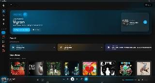
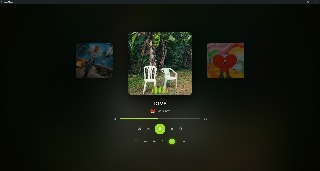
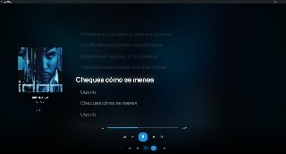
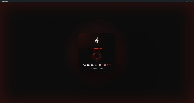

# 🎵 SeaxMusic V2 — The Immersive Desktop Player


**SeaxMusic V2** es una experiencia musical de escritorio de alta fidelidad, diseñada para ofrecer una inmersión visual y sonora total. Utilizando un motor híbrido basado en YouTube y Electron, combina la vasta biblioteca de la web con una interfaz premium, fluida y totalmente reactiva al audio.

## 📸 Capturas de Pantalla

<p align="center">
  
  
</p>
<p align="center">
  
  
</p>

---

## ✨ Características Premium (V2.0+)

### 🌈 Aura Engine™ (Dynamic Color Extraction)
Nuestro motor de color inteligente analiza la carátula de la canción actual en milisegundos para extraer su paleta de colores dominante. Esta paleta inunda la interfaz mediante:
- **Aura Ambient:** Resplandores suaves que rodean las carátulas y controles.
- **Wave Effect:** Una ola de color rítmica que emerge de la barra de reproducción.
- **Unified Accents:** Los botones y visualizadores se adaptan automáticamente al color de la música.

### 🌊 Visualización de Audio en Tiempo Real
Siente la música con visualizadores analíticos de alta frecuencia:
- **Main Visualizer:** 12 barras dinámicas en el modo pantalla completa.
- **Mini-Viz:** Barras compactas en el carrusel de letras para una respuesta visual constante.
- **Breathing Background:** El fondo difuminado "respira" y escala rítmicamente con los bajos.

### 🎧 DJ Seax Engine
Un sistema de mezcla inteligente que garantiza que la música nunca se detenga:
- **Transiciones Fluidas:** Fundidos cruzados y transiciones animadas entre pistas.
- **Auto-Playlists:** Generación automática de listas basadas en tus momentos y moods.
- **DJ Pulse:** El botón de DJ late físicamente con el ritmo, indicando el estado del motor de mezcla.

---

## 🛠️ Stack Tecnológico
- **Core:** [Electron](https://www.electronjs.org/) para una integración nativa potente.
- **Audio:** Web Audio API & AnalyserNodes para visualización de espectro.
- **Estilos:** CSS3 Modular con variables dinámicas y aceleración por GPU.
- **Integración:** Discord Rich Presence nativo con visualización de carátulas.

---

## 📂 Estructura del Proyecto

```text
SeaxMusicV2/
├── src/
│   ├── main/             # Proceso Principal (Ventanas, IPC, Discord, AutoUpdater)
│   ├── preload/          # Capas de seguridad y comunicación IPC
│   └── renderer/         # Interfaz de Usuario Premium
│       ├── css/          # Arquitectura CSS Modular (Base, Components, Pages)
│       ├── html/         # Vistas de la aplicación
│       └── js/
│           ├── core/     # Motores: auraEngine.js, djEngine.js, app.js
│           └── pages/    # Lógica específica por vista
└── build/                # Recursos de empaquetado para distribución
```

---

## 🚀 Instalación y Desarrollo

Para ejecutar SeaxMusic en tu entorno local:

1. **Instalar dependencias:**
   ```bash
   npm install
   ```

2. **Iniciar en modo producción:**
   ```bash
   npm start
   ```

3. **Modo Desarrollo (con DevTools):**
   ```bash
   npm run dev
   ```

---

## 🎨 Guía de Diseño (Branding)
SeaxMusic utiliza una estética **Glassmorphic Dark** con los siguientes pilares:
- **Primary Background:** `#121212` (Minimalismo puro)
- **Secondary Surface:** `#181818` (Profundidad visual)
- **Signature Accent:** `#E13838` (Rojo Seax original)
- **Dynamic Accent:** Variantes generadas por el **Aura Engine** según el álbum.

---

## 📝 Créditos
Desarrollado con pasión por **Vyran** y el equipo de **SeaxMusic**.

---
*SeaxMusic no está afiliado a YouTube. Es un cliente de terceros diseñado para mejorar la experiencia de usuario en escritorio.*